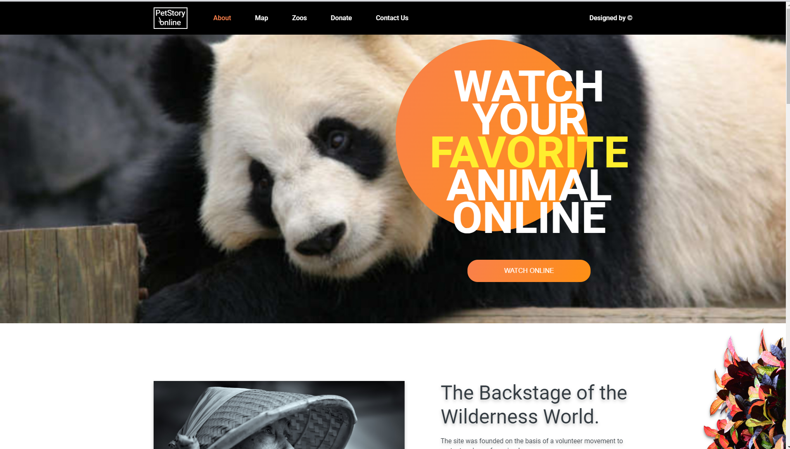

# Online Zoo

>**Online-zoo is a platform that contains information about animals from various zoos. A user can open the page with zoo resources, observe one of the animals, or make a donation that will be used to purchase food. This is one of the @rolling-scopes-school *[Javascript/Front-end Mentoring Program](https://github.com/rolling-scopes-school/js-fe-course-en)* personal tasks / projects**

## Features

- Decorative Images on Site
- Smooth Animation on Hover
- Pixel-perfect Design

  

## Live CV

[View live version](https://omolara5861.github.io/online-zoo/)

## Technologies Used

- HTML5
- CSS
- Flexbox
- Pixel-Perfect Design

## Challenges Faced

A major challenge I faced in this project was making the project a pixel-perfect design

## Part of Week 6 & 7 Tasks